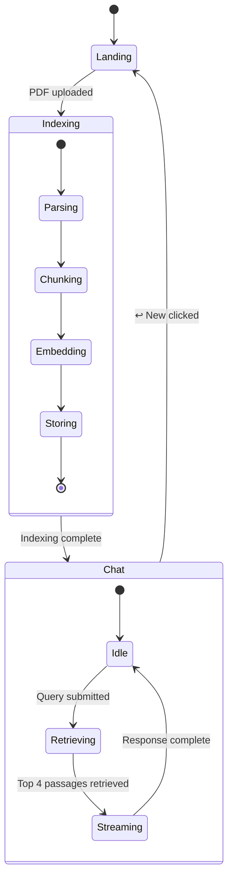
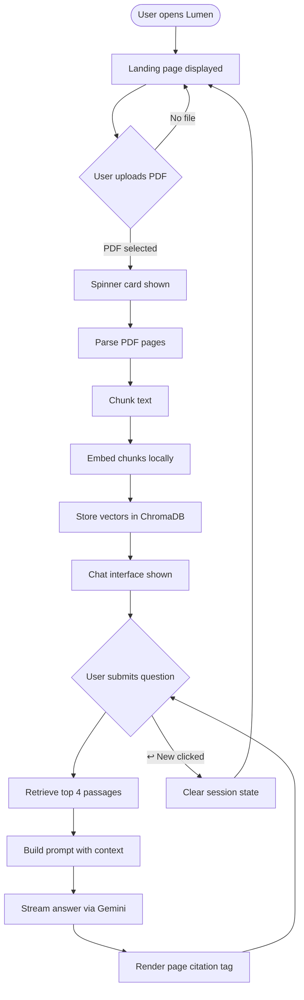
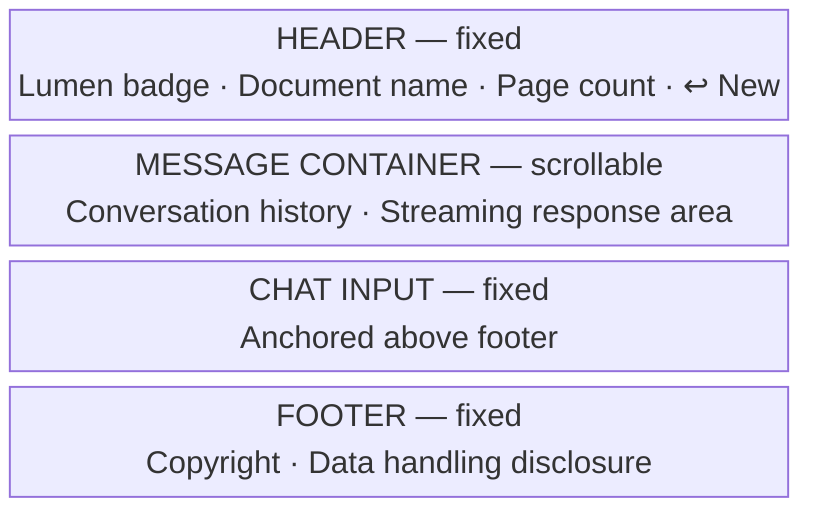

# Functional Specification Document (FSD) — Lumen

**Project:** Lumen — RAG-Powered PDF Chat Tool  
**Author:** Huzaifa Najam  
**Status:** Active

---

## Overview

Lumen is a single-page PDF chat application enabling users to upload a document and ask questions about it in natural language. The system operates without authentication, accounts, or persistent storage. All interaction occurs within a single browser session tied to the uploaded document. The interface is a fully custom UI built on top of Streamlit — all default Streamlit chrome (sidebar, hamburger menu, header, footer) is hidden and replaced with purpose-built components.

## Core Functionality

### Document Upload

- Accepts PDF files only; non-PDF formats are rejected at the file picker level
- Maximum file size is read at startup from `.streamlit/config.toml` (`server.maxUploadSize`); defaults to 200 MB if the config is absent or unreadable
- The upload surface is a custom card component (`Drop your PDF here / or click to browse`) — clicking anywhere on the card triggers the hidden native file input via JavaScript
- File selection via drag-and-drop onto the card is also supported
- Once a file is selected, the application transitions immediately to the Indexing state — the user cannot interact with the chat until indexing completes

### Document Indexing

- On upload, the document is parsed page by page using `pypdf`
- Text is chunked using `RecursiveCharacterTextSplitter` with a chunk size of 1000 tokens and an overlap of 200 tokens
- Each chunk is stored as a `Document` object with its source page number preserved as metadata
- Chunks are embedded locally using `HuggingFaceEmbeddings` (model: `all-MiniLM-L6-v2`) — no document content is transmitted externally at this stage
- Vectors are stored in an in-memory ChromaDB collection named `doc_{timestamp}` to prevent cross-session contamination
- During indexing, a spinner card is displayed inline with the upload area showing "Indexing your document…"
- Once indexing completes, the spinner card is cleared, a 0.4-second pause is observed, and the application transitions to the Chat state

### Query and Answer

- Users submit natural language questions via the chat input bar
- On submission, the query is embedded using the same local model and the top 4 most semantically similar chunks are retrieved from ChromaDB via cosine similarity search
- Retrieved passages are assembled into a prompt together with the last 6 messages of conversation history
- The prompt enforces five explicit rules on the model:
  1. Answer only using the document context provided
  2. If the answer is not in the context, respond with exactly: "I cannot find this in the document."
  3. Always append (PBUH) after the name of the Prophet Muhammad — and no other name
  4. Do not use outside knowledge
  5. Be concise and accurate
- The answer is streamed token-by-token via the Gemini API and rendered in real time in the chat message container
- Once the stream completes, a page citation tag (`📖 page(s) X, Y`) is appended beneath the response, identifying every source page that contributed to the answer
- The completed exchange (user message + assistant message + pages) is appended to session history and the application reruns

### Conversation History

- The full conversation is displayed in a scrollable message container
- The last 6 messages (user and assistant turns combined) are passed as context to the model on each query
- Messages earlier than the last 6 are visible in the UI but excluded from the prompt context
- The initial assistant message on entering the chat state is: *"I've read {filename} ({N} pages). What would you like to know?"*

### Session Reset

- The "↩ New" button in the chat header clears the vector store, document name, page count, and full message history from session state
- The application reruns immediately and returns to the Landing state
- No confirmation is required

## Application States

The application operates in three distinct states:

1. **Landing:** Default state on first load or after reset. Displays the title, subtitle, and upload card. No document is loaded.
2. **Indexing:** Transitional state entered immediately after a PDF is selected. The upload area remains visible with the spinner card displayed beneath it. The chat interface is not accessible.
3. **Chat:** Active state entered after indexing completes. Displays the chat header, scrollable message history, fixed chat input, and fixed footer. Persists until the user resets.

### State Diagram

## User Flow

## UI Layout (Chat State)

- **Header (fixed):** Contains the Lumen badge, the uploaded document's filename and page count in a monospace pill, and the "↩ New" reset button. Does not scroll.
- **Message container (scrollable):** Displays the full conversation history. Height is dynamically calculated by JavaScript to fill exactly the space between the bottom of the header and the top of the chat input — accounting for footer height (58px), input height (72px), and a 4px gap. Recalculated on load (300ms and 900ms after render) and on window resize.
- **Chat input (fixed):** Anchored 90px from the bottom of the viewport via CSS, floating above the footer at all times regardless of message volume.
- **Footer (fixed):** Displays "© 2026 Lumen by Huzaifa Najam. All rights reserved." and the data handling notice: "Relevant excerpts from your document are sent to Google Gemini for answer generation and are not stored. Do not upload documents containing sensitive personal data." Visible in all application states.

## Error Handling

- **Missing or invalid API key:** `st.error()` is displayed and `st.stop()` halts execution before any query is processed; the user sees the error in the Streamlit UI
- **PDF parsing failure:** Exception propagated from `pypdf`; no partial indexing results are shown
- **Empty or unreadable pages:** `page.extract_text()` returns an empty string; such pages are silently skipped during chunking and the remaining content is indexed normally
- **API generation errors:** Propagated through the Gemini streaming iterator; any partial response already rendered remains visible

## Data Handling Disclosure

The footer displays a persistent notice in all application states:

> *Relevant excerpts from your document are sent to Google Gemini for answer generation and are not stored. Do not upload documents containing sensitive personal data.*

This notice accurately reflects the system's behaviour: only the top 4 retrieved passages (not the full document) are transmitted to Gemini as part of the generation prompt. Raw document content never leaves the server during the embedding stage.

## Performance Characteristics

- Indexing time scales with document length and page count; typical documents index within a few seconds on local hardware
- Query retrieval via ChromaDB's in-memory vector search is near-instantaneous
- Answer streaming begins within seconds of query submission, dependent on Gemini API response latency
- The embedding model (`all-MiniLM-L6-v2`) is loaded once and cached for the lifetime of the Streamlit process; subsequent sessions and reruns within the same process incur no reload cost
