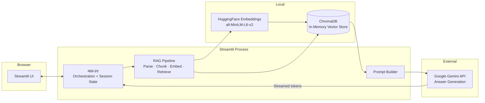
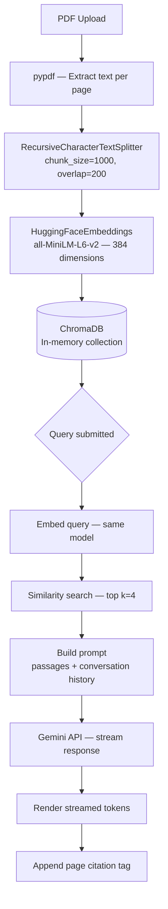

# Technical Specification Document (TSD) — Lumen

**Project:** Lumen — RAG-Powered PDF Chat Tool  
**Author:** Huzaifa Najam  
**Status:** Active

---

## Overview

Lumen is a single-process, single-file web application with no database and no backend server of its own — Streamlit is the server. The system comprises three tiers: browser UI, the Streamlit process (combining orchestration, RAG pipeline, and business logic), and the external Gemini API. All vector storage and embedding generation occur in-process, in-memory, with no external data store.

## Architecture Highlights

**Three-tier design:**
- Browser renders Streamlit's client-side UI
- Streamlit process hosts `app.py` — UI orchestration, RAG pipeline, session state, and prompt construction
- Google Gemini API handles answer generation only; retrieval and embedding are local

Deliberately absent: database, message queue, user authentication, persistent storage. State lives entirely in Streamlit's per-session context and is lost on refresh — aligned with the project's no-accounts, no-storage requirement.

### Architecture Diagram

## Technology Stack

| Layer | Technology |
|-------|------------|
| UI / Server | Streamlit (Python) |
| AI Model | Google Gemini 3.1 Flash Lite |
| Embedding Model | HuggingFace `all-MiniLM-L6-v2` (local) |
| Vector Store | ChromaDB (in-memory, per session) |
| RAG Orchestration | LangChain (text splitting, document schema, Chroma integration) |
| Document Parsing | pypdf |
| Hosting | Streamlit Community Cloud |

## Module Organization

**`app.py`:** Single-file application containing all logic — page config, CSS, session state, RAG pipeline, prompt construction, streaming, and UI rendering. No separate core module; the application is small enough to remain coherent as a single file.

**`docs/`:** BRD, FSD, and TSD.

**`.streamlit/config.toml`:** Server configuration including upload size limit.

**`.streamlit/secrets.toml`:** Local-only API key storage (not committed).

## RAG Pipeline

### Pipeline Diagram

### Pipeline Steps

1. **Parsing:** `pypdf.PdfReader` extracts raw text from each page; page number is preserved as document metadata
2. **Chunking:** `RecursiveCharacterTextSplitter` splits text into 1000-token chunks with 200-token overlap to preserve context across boundaries
3. **Embedding:** `HuggingFaceEmbeddings` (all-MiniLM-L6-v2) generates 384-dimension vectors locally — no document content is sent externally at this stage
4. **Storage:** Chunks stored in a per-session ChromaDB collection keyed by timestamp to prevent cross-session contamination
5. **Retrieval:** On each query, the same embedding model vectorises the question; ChromaDB returns the top 4 most similar chunks by cosine similarity
6. **Prompt construction:** Retrieved passages are assembled with the last 6 messages of conversation history into a strict prompt forbidding outside knowledge
7. **Generation:** Gemini streams the response token-by-token; source page numbers are extracted from chunk metadata and rendered as a citation tag

## Request Flow

User submits query → query embedded locally → top 4 passages retrieved from ChromaDB → prompt built with passages and history → Gemini API called with streaming → tokens rendered in real time → page citation tag appended → message appended to session history → rerun.

## Gemini API Configuration

| Parameter | Setting |
|-----------|---------|
| Model | `gemini-3.1-flash-lite` |
| Temperature | 0.4 |
| Max output tokens | 3000 |
| Streaming | Enabled |
| Auth | API key from `st.secrets["GOOGLE_API_KEY"]` |

## Session State

| Key | Type | Description |
|-----|------|-------------|
| `vector_db` | `Chroma` | In-memory vector store for the current document; `None` on landing |
| `doc_name` | `str` | Filename of the uploaded document |
| `doc_pages` | `int` | Total page count of the uploaded document |
| `messages` | `list` | Full conversation history for the current session |

## Caching Strategy

| Resource | Cache Mechanism | Scope |
|----------|----------------|-------|
| HuggingFace embedding model | `@st.cache_resource` | Process lifetime |
| Gemini client | `@st.cache_resource` | Process lifetime |
| ChromaDB vector store | Streamlit session state | Per session |

The embedding model is the most expensive resource to load (~seconds on first boot); caching it at process level means subsequent sessions and reruns pay no reload cost.

## Configuration & Secrets

- `.streamlit/config.toml`: Server config including `maxUploadSize`; read at startup via `tomllib` so the UI reflects the actual configured limit
- `.streamlit/secrets.toml`: Local-only API key storage
- Streamlit Cloud secrets: `GOOGLE_API_KEY` injected via the Streamlit Cloud dashboard

## Deployment

**Streamlit Community Cloud** watches the `main` branch and auto-deploys on every push. The embedding model is downloaded on first boot and cached for the lifetime of the container.

## Known Constraints

- ChromaDB vector store is in-memory and per-session — document must be re-indexed on every new session or page refresh
- Free-tier Streamlit compute is limited; indexing large documents may be slower than on local hardware
- Single API key shared across all deployed users; no rate-limit mitigation beyond Gemini SDK internals
- Conversation history is capped at the last 6 messages to control prompt size; earlier messages are excluded from context
- Page refresh during indexing loses the in-flight state; the user must re-upload (by design, consistent with the no-storage model)

---

**Full traceability:** Each FSD functional requirement maps to a specific implementation artifact — pipeline steps, session state keys, CSS zones, or API configuration parameters documented above.
